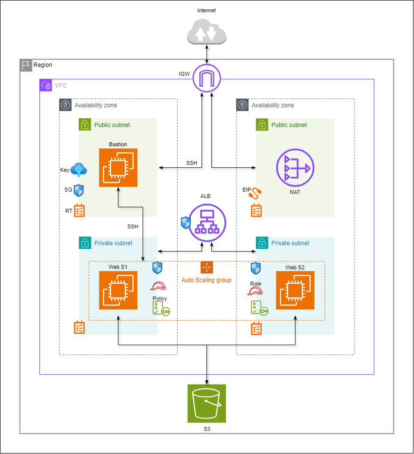

# 🚀 Terraform AWS Scalable Web App  
[](https://www.terraform.io/)
[](https://aws.amazon.com/)
[](https://github.com/AdGamal/terraform-aws-scalable-webapp/actions) 
[](./LICENSE)

A production-style AWS architecture deployed entirely with **one Terraform file**.  
Private subnets, internal ALB, Auto Scaling, NAT, IAM, and a bastion host — all stitched together in clean Terraform code.


---

## 🌐 What This Project Deploys

### **Network Layer**
- VPC (`10.0.0.0/16`)
- 2 Public subnets (bastion + NAT)
- 2 Private subnets (web servers)
- Internet Gateway  
- NAT Gateway for outbound traffic

### **Compute & Scaling**
- Auto Scaling Group (2–3 EC2 instances)
- Launch Configuration with HTTP server
- Private EC2 instances (no public IPs)
- Bastion host for secure SSH entry

### **Load Balancing**
- Internal Application Load Balancer  
- Target Group + HTTP Health Checks  
- Listener on port 80

### **Security**
- Bastion SG → SSH from your IP  
- ALB SG → HTTP from VPC  
- App SG → HTTP only from ALB  
- NAT → outbound only  
- Private workload fully isolated  

### **IAM & Storage**
- IAM Role for EC2  
- IAM Policy for S3 bucket access  
- Instance Profile  
- S3 bucket  

---

## 🧩 ASCII Architecture Diagram

 ```
                 ┌──────────────────────────────────────┐
                 │              Internet                │
                 └───────────────────┬──────────────────┘
                                     │
                                     ▼
                          ┌──────────────────────┐
                          │   Bastion Host (22)  │
                          └──────────┬───────────┘
                                     │  SSH
                                     │
            ┌────────────────────────┼────────────────────────┐
            │                        │                        │
            ▼                        ▼                        ▼
  ┌──────────────────┐      ┌──────────────────┐      ┌──────────────────┐
  │ Public Subnet A  │      │ Public Subnet B  │      │   Internet GW    │
  │ (Bastion)        │      │ (NAT Gateway)    │      │ (Outbound only)  │
  └────────┬─────────┘      └────────┬─────────┘      └────────┬─────────┘
           │                        │                         │
           │                        │                         │
           │                        ▼ NAT                     │
       ┌──────────────────────────────────────────────────────────┐
       │                      Private Subnets                     │
       │   (Web Servers inside Auto Scaling Group)                │
       │                                                          │
       │      ┌──────────────────────┐     ┌────────────────────┐ │
       │      │   Web Server 1       │     │   Web Server 2     │ │
       │      └──────────┬───────────┘     └──────────┬────────┘  │
       │                 HTTP (80)                     │          │
       └──────────────────────────┬────────────────────┼──────────┘
                                  │                    │
                                  ▼                    ▼
                     ┌──────────────────────────────────────────┐
                     │     Internal Application Load Balancer   │
                     │              (Listener: 80)              │
                     └──────────────────────────────────────────┘
```


---

## 📈 Terraform Graph (Conceptual)
```
VPC
├── Subnets
│ ├── Public A (Bastion)
│ ├── Public B (NAT)
│ ├── Private A (ASG)
│ └── Private B (ASG)
├── Internet Gateway
├── NAT Gateway
├── Route Tables
│ ├── Public RT → IGW
│ └── Private RT → NAT
├── Security Groups
│ ├── bastion_sg
│ ├── alb_sg
│ └── app_sg
├── ALB
│ └── Target Group
│ └── Listener
├── IAM Role + Instance Profile
└── Auto Scaling Group
└── Launch Configuration
```

---

## ⚙️ How to Deploy

### Initialize Terraform  
```bash
terraform init
```

Preview Infrastructure
```
terraform plan
```

Apply Changes
```
terraform apply
```

Destroy Infrastructure
```
terraform destroy
```

## 📌 Usage Examples

1 — SSH into Bastion
``` 
ssh -i my-key.pem ec2-user@$(terraform output -raw bastion_public_ip)
 ```

2 — SSH into Private EC2
``` 
ssh ec2-user@<private-ip>
```

3 — Test Web App
```
curl http://$(terraform output -raw alb_dns_name)
 ```

## 🔐 Security Model


| Component       | Allowed Traffic                                     |
| --------------- | --------------------------------------------------- |
| **Bastion SG**  | SSH **only from your IP**                           |
| **ALB SG**      | HTTP **only from inside the VPC**                   |
| **App SG**      | HTTP **only from ALB SG**                           |
| **Private EC2** | No public IP — outbound **only via NAT**            |
| **NAT Gateway** | Outbound internet for updates, S3, package installs |


## 📁 Project Structure
```
terraform-aws-scalable-webapp/
└── diagram/
    └── diagram.png
│── .github/workflows/
    └── workflows/
    └── main_terraform.yml
│── .gitignore
│── LICENSE
│── README_MINIMAL.md
│── README.md
│── main.tf
```

## 🧠 What You Learn  
• VPC subnet isolation  
• Internal ALB flow  
• NAT outbound behavior  
• IAM roles vs access keys  
• ASG + ALB integration  
• Terraform end-to-end wiring


## 🏁 Next Enhancements

Upgrades that can turn this into a full production-grade setup:

🔐 Add HTTPS (ACM certificate + ALB HTTPS listener)

🗄️ Add RDS in private subnets for app data

🛡️ Add AWS WAF to protect your ALB

🚀 Add CI/CD pipeline (GitHub Actions → Terraform Cloud or OIDC)

📊 Add CloudWatch alarms & dashboards

📦 Enable ALB + S3 access logging

🔧 Switch SSH → SSM Session Manager

🛟 Enable AWS Backup snapshots


## 📜 License

MIT License — free to use, fork, improve.
